# Project 32 – Terraform Remote State & State Locking

## Project Overview

This project demonstrates how to implement enterprise-grade Terraform state management using Amazon S3 as a remote backend and DynamoDB for state locking.

The project begins with a local Terraform state, provisions the backend infrastructure, migrates the state to Amazon S3, verifies remote state functionality, demonstrates concurrent state locking, and safely cleans up all backend resources.

This workflow closely mirrors how Infrastructure as Code is managed in production DevOps environments.

---


## Objectives 

- Understand Terraform State
- Learn Local vs Remote State
- Configure an S3 Remote Backend 
- Implement State Locking with DynamoDB
- Migrate Local State to Remote State
- Demonstrate Team Collaboration
- Understand Backend Bootstrapping
- Practice Production Terraform Workflow

---

## Technologies Used

- Terraform 
- AWS S3
- AWS DynamoDB
- AWS CLI

---

## Project Structure

```text
32-terraform-remote-state/

├── README.md
├── docs/
│   ├── architecture.md
│   ├── interview-questions.md
│   └── production-notes.md
│
├── troubleshooting/
│   └── common-errors.md
│
├── screenshots/
│
└── terraform/
    ├── backend.tf
    ├── provider.tf
    ├── variables.tf
    ├── terraform.tfvars.example
    ├── main.tf
    └── outputs.tf
```

---

## Architecture

```
                Developer A
                     │
                terraform apply
                     │
                     ▼
              Amazon S3 Backend
             (terraform.tfstate)
                     │
                     ▼
          DynamoDB State Locking
                     │
          Prevents Concurrent Changes
```

---

## Workflow

1. Configure Terraform locally.
2. Create S3 bucket and DynamoDB table.
3. Configure remote backend.
4. Migrate Terraform State.
5. Verify remote backend.
6. Demonstrate state locking.
7. Destroy backend infrastructure safely.

---


## Skills Learned 

- Terraform State
- Remote Backend
- State Migration
- State Locking 
- Backend Bootstrapping 
- S3 Versioning
- Infrastructure Collaboration
- Enterprise Terraform Workflow

---

## Production Improvements

A production implementation would additionally include:

- Encrypted S3 Bucket (KMS)
- Bucket Policies
- IAM Least Privilege 
- Cross-Region Replication
- Automated Backend Provisioning
- CI/CD Integration
- Multi-Environment Workspaces

---

---

## Screenshots

### Backend Infrastructure Code

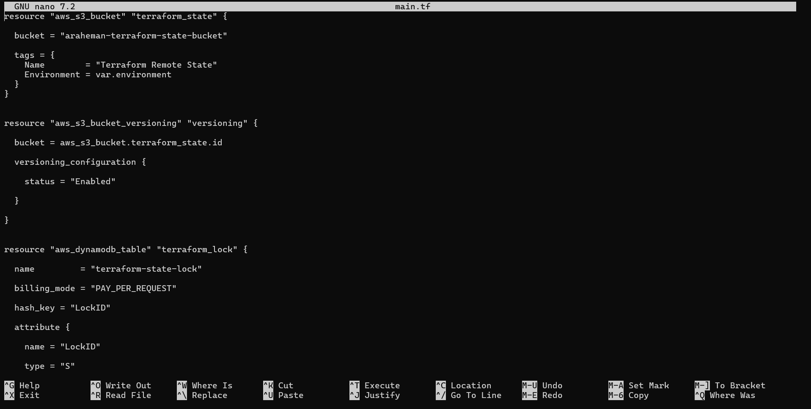

---

### Terraform Validation

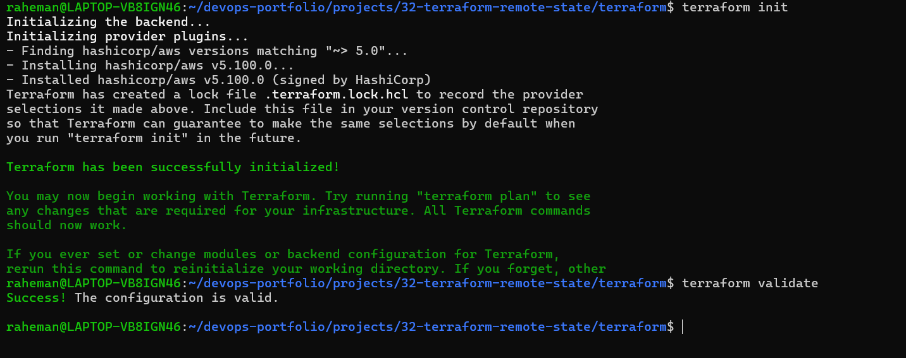

---

### Terraform Execution Plan

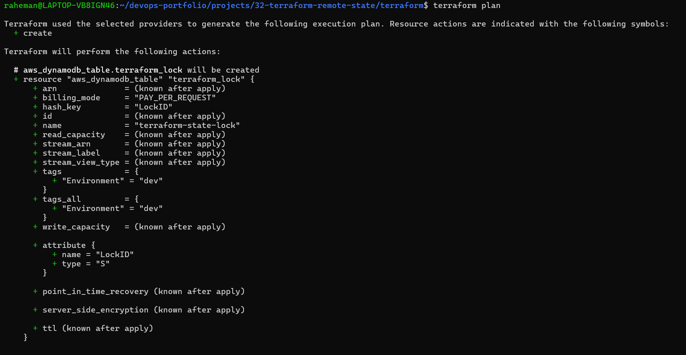

---

### Backend Infrastructure Deployment

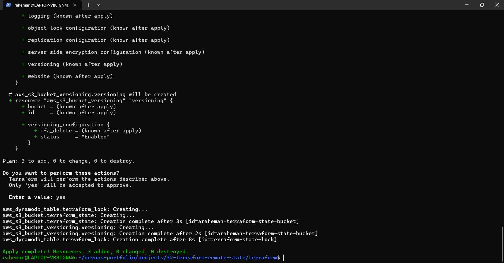

---

### Amazon S3 Remote State Bucket

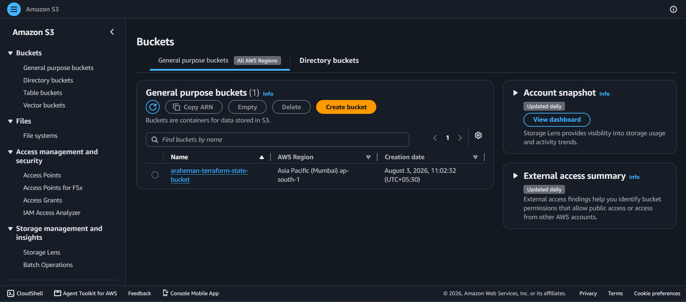

---

### DynamoDB State Lock Table

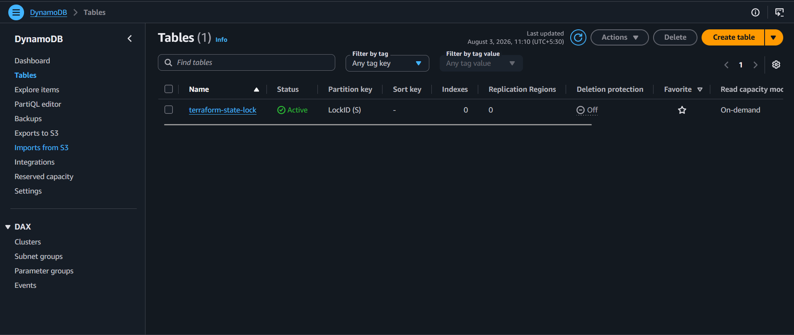

---

### Remote State Migration

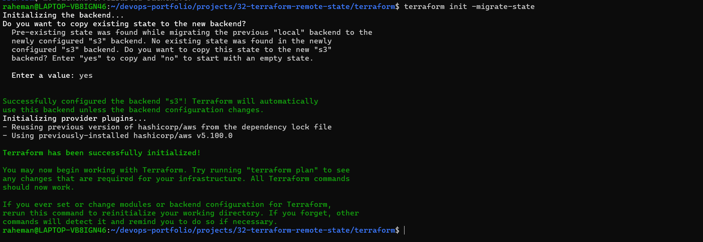

---

### Remote Backend Verification

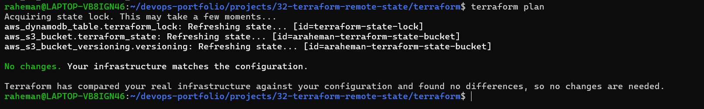

---

### Terraform State Stored in Amazon S3

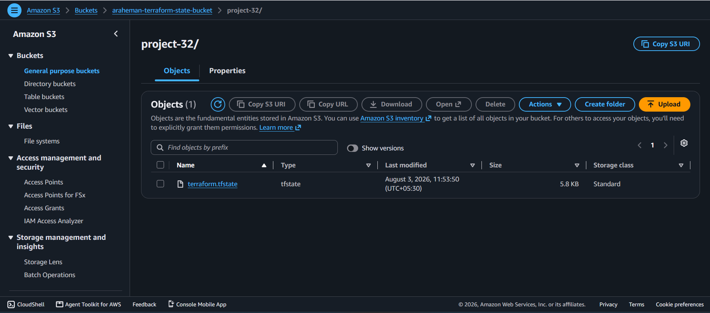

---

### State Locking Demonstration

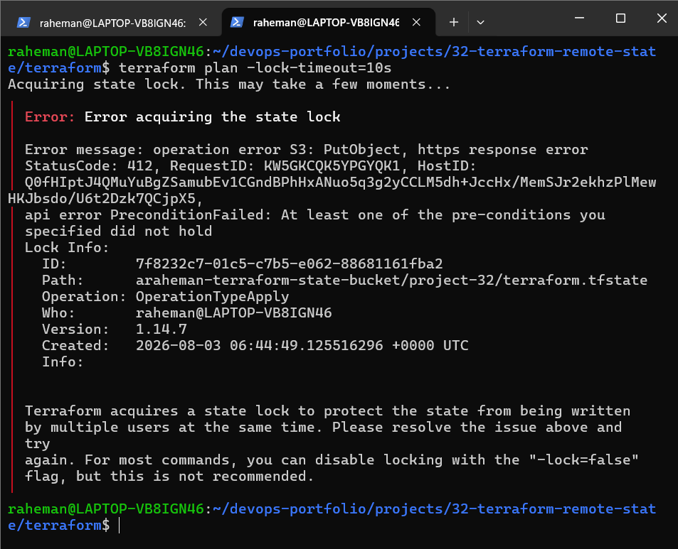

---

### State Migration Back to Local Backend

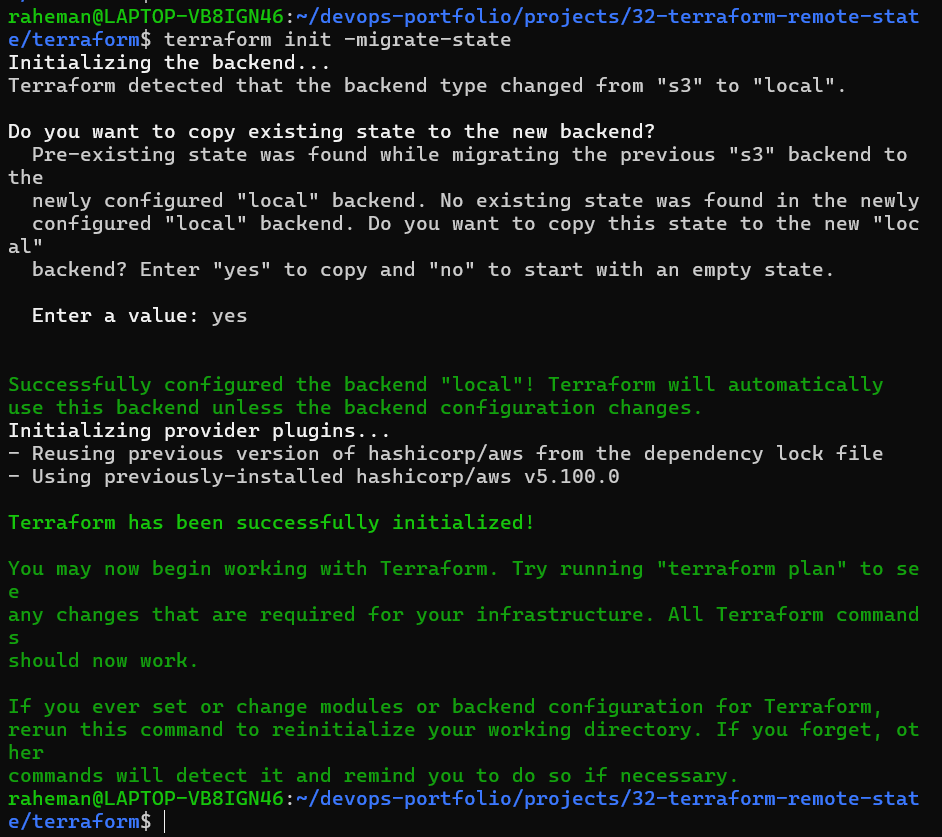

---

### Backend Infrastructure Cleanup

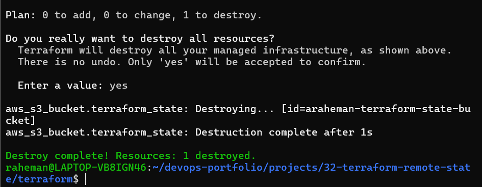

---

### AWS Cleanup Verification

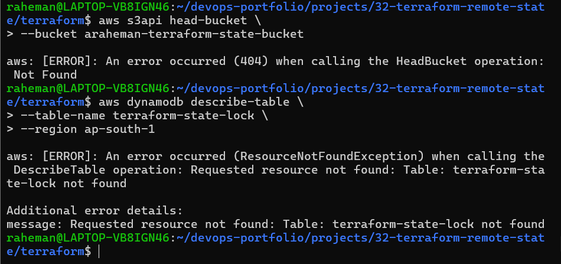

---

## Project Status 

Completed
